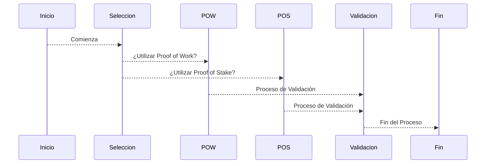

<h1 align = "center">
  Seguridad y Algoritmos de Consenso
</h1>

los algoritmos de consenso en la blockchain desempeñan un papel crucial en la seguridad y la integridad de la red. 

_ Dos de los algoritmos de consenso más comunes son Proof of Work (PoW) y Proof of Stake (PoS)

## 🚀 Proof of Work 
1. ** (PoW) **

    El algoritmo de consenso se asemeja al proceso de minería, donde los nodos de la red (o "mineros") compiten para resolver complejos rompecabezas matemáticos para validar y agregar bloques a la blockchain. Este proceso requiere una cantidad significativa de poder computacional y energía, lo que hace que la red sea más segura contra ataques de spam y manipulación.

    _Nota: [MasInfo](https://es.wikipedia.org/wiki/Prueba_de_trabajo_(algoritmo_de_consenso_distribuido))

## 🚀 Proof of Stake 
1. ** (PoS) **

   El algoritmo de consensofunciona de manera diferente al asignar la responsabilidad de validar transacciones a los nodos según la cantidad de criptomonedas que poseen y están dispuestos a "apostar" como garantía. Esto elimina la necesidad de recursos intensivos en energía, haciéndolo más eficiente y ecológico que PoW. 

    _Nota: [MasInfo](https://es.wikipedia.org/wiki/Prueba_de_apuesta)

Además de estos, existen otros mecanismos de consenso, como Delegated Proof of Stake (DPoS), Practical Byzantine Fault Tolerance (PBFT) y más, cada uno con sus propias ventajas y desafíos en términos de seguridad y escalabilidad.

## Autora ✒️
**Lisas** -Para el WomenBiz

* Gracias por pasar 📢 y ahora a seguir estudiando

---

<> con ❤️
